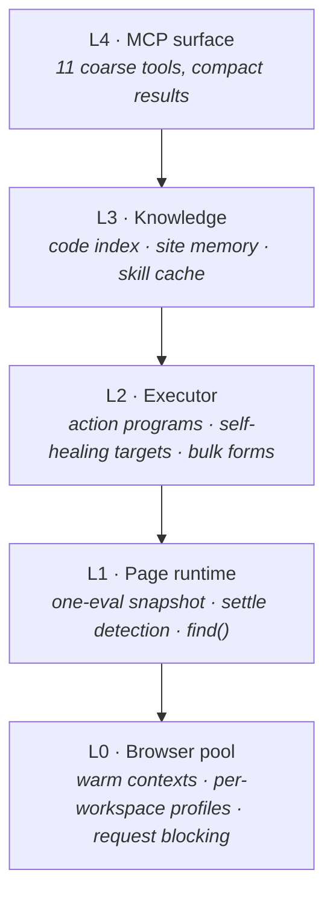

<div align="center">

# ⚡ faster-browser-agent

**The browser driver built for AI agents — not for test scripts.**

It reads your code before it opens a page, learns every site it visits,
executes whole action programs in one call, and gives every git worktree
its own browser identity.

[](tsconfig.json)
[](package.json)
[](test/)
[](src/mcp/tools.ts)
[](LICENSE)

[Quick start](#-quick-start) •
[Why it's fast](#-why-its-fast) •
[Tools](#-the-eleven-tools) •
[Features](#-what-makes-it-different) •
[Architecture](#-architecture) •
[CLI](#-cli)

</div>

---

## The problem

Generic browser MCP servers are slow for reasons that have little to do with the browser:

- **One model call per click.** A 25-step flow costs 25 rounds of inference — 70–90 % of wall-clock time.
- **Token-wall perception.** A raw accessibility tree of a settings page is ~8,000 tokens, re-sent every step.
- **Blindness.** They discover your app by clicking around it — while its route table, tab definitions and config schema sit right there in your workspace.
- **Amnesia.** Every visit to every site starts from zero.

This project attacks all four, in that order.

## 🚀 Quick start

```bash
npm install -g faster-browser-agent   # or run from a clone: npm i && npm run build && npm link
fba doctor                            # verifies chromium, workspace detection, index
```

<details open>
<summary><b>Claude Code</b></summary>

```bash
claude mcp add browser -- fba mcp
```
</details>

<details>
<summary><b>Any MCP host</b> (<code>.mcp.json</code>)</summary>

```json
{
  "mcpServers": {
    "browser": {
      "command": "fba",
      "args": ["mcp"],
      "env": { "FBA_WORKSPACE": "/path/to/your/project" }
    }
  }
}
```
</details>

<details>
<summary><b>As a Claude Code plugin</b> (MCP server + power-user skill)</summary>

The repository is itself a plugin — it ships the server plus a
`browser-power-user` skill that teaches the agent the efficient patterns
(batch actions, deep-link, screenshot only when text fails).

```bash
claude plugin install /path/to/faster-browser-agent
```
</details>

## 📊 Why it's fast

All numbers measured on this codebase's fixture — a settings page with nested
tabs, collapsed accordions, a 40-row table and a modal. Reproduce with
`fba bench` and `npm test`.

**Perception cost per observation:**

| What the model receives | Size |
|---|---|
| Raw DOM (`page.content()`) | 16,061 chars · ~4,000 tokens |
| Raw accessibility tree | 31,933 chars · ~8,000 tokens |
| **fba, full page** | **1,438 chars · ~360 tokens** |
| **fba, after one click (diff)** | **~596 chars · ~149 tokens** |

**Round trips per task:**

| Task | Generic driver | fba |
|---|---|---|
| Reach a 3rd-level config tab | 3 navigations · 3 model calls | 1 deep link · **1 call** |
| Fill a 30-field settings form | ~30 model calls | **1 call** |
| Repeat a known flow | full model-driven run | **0 model calls** · 675 ms |
| Revisit a site | starts blind | answers from memory · 44 % less waiting |
| Wait after an action | fixed 2 s sleeps | settle heuristic · 128–515 ms even on polling apps |

**Browser-side medians** (`fba bench`): warm tab 87 ms · navigate 48 ms ·
snapshot of 97 controls 13 ms · element screenshot 1 KB.

## 🧰 The eleven tools

Tool definitions are resident context on every model turn, so the surface is
itself a latency cost. Eleven coarse tools — `click`, `type`, `press` are
*steps inside* `browser_act`, not tools.

| Tool | What it does |
|---|---|
| `browser_open` | Open a URL **or a route resolved from your source code** |
| `browser_snapshot` | Observe — a compact diff by default, full tree on request |
| `browser_act` | Run a guarded **program**: 27 step types, one call, stops on divergence |
| `browser_form` | Fill many fields by human label; tab switch + submit + verify included |
| `browser_find` | Locate by meaning across live page + code index + learned memory |
| `browser_map` | The app map — from source, from memory, or both |
| `browser_extract` | Structured extraction, or replay an API the page itself called |
| `browser_skill` | Compile & replay trajectories — **zero model calls** |
| `browser_session` | Per-workspace state · warm · seed · **inject cookies/storage instead of driving a login UI** |
| `browser_screenshot` | 📸 Smart-lazy vision — see below |
| `browser_net` | Mock, block, inject headers, go offline — at runtime |

## ✨ What makes it different

### 1 · Code-aware navigation — including apps with no framework

The workspace is indexed in milliseconds (routes across 12 frameworks,
`data-testid`s, declarative tab arrays, zod/JSON-Schema config fields, i18n
catalogues, the dev-server port from your scripts):

The workspace is indexed in milliseconds (routes across 12 frameworks,
`data-testid`s, declarative tab arrays, zod/JSON-Schema config fields, i18n
catalogues, the dev-server port from your scripts):

```console
$ fba map advanced
score  kind   label     url                                       source
 1.00  route  Advanced  http://localhost:4321/settings/advanced   src/app/settings/advanced/page.tsx:1
```

`browser_open {route: "settings/advanced"}` is a **deep link** — not three clicks.

### 2 · Compressed perception, then diffs

One injected script returns the whole observation in a single round trip.
Viewport scoping, modal scoping, collapsed sections as one line, repeated rows
folded (`… +37 similar`). After the first look, you get diffs:

```diff
@ tab Settings > General -> Settings > Advanced
~ e12 text "SMTP host"  "" -> "smtp.acme.io"
~ e34 status "Saving…" -> "Saved"
```

### 3 · Waiting that survives real apps

`waitForTimeout(2000)` is the most common hidden time sink, so settling is a heuristic —
but the obvious heuristic is wrong. Requiring DOM *and* network quiet means any app with a
React Query refetch interval, a session heartbeat or an HMR channel never settles.
Measured against a real Next.js admin console: **3.3 s per action, 96 % of wall-clock**, on
a page visibly done in 150 ms.

The rule is **DOM quiet is necessary; network quiet is sufficient but not necessary.** When
the DOM has been still for a confidence window while traffic continues, it settles and
reports `dom-stable`. That is safe precisely because a request that *matters* mutates the
DOM when it lands, resetting the clock — only traffic that changes nothing takes the
shortcut. Measured on a 120 ms poller: **515 ms instead of a 5 s timeout.**

### 4 · Action programs, not single actions

```jsonc
{"steps": [
  {"do": "selectTab", "path": ["Network", "SMTP"]},
  {"do": "type",   "target": {"label": "SMTP host"}, "text": "smtp.acme.io", "clear": true},
  {"do": "check",  "target": {"label": "Use TLS"}, "checked": true},
  {"do": "click",  "target": {"role": "button", "name": "Save"}},
  {"do": "assert", "text": "Saved"}
]}
```

Executed deterministically; control returns to the model only on divergence.
Targets **self-heal** — a stale ref falls through testId → role+name → label →
text and the step still runs. Ambiguity is never guessed: the error lists the
candidates. 27 step types including `selectTab`, `expand`, `drag`, `resize`,
`download`, `clickAt`, `eval`.

### 5 · Smart-lazy screenshots 📸

Text perception is ~20× cheaper, so screenshots are an **escape hatch, not a
habit** — and the system tells the agent exactly when to reach for one:

- Canvas/WebGL-heavy pages **announce themselves** in the snapshot:
  `canvas-heavy page — browser_screenshot + clickAt {x,y} is the way in`
- Every default minimizes cost: JPEG q60, viewport clip, animations disabled,
  full-page height-capped. An **element clip is ~1 KB**; a viewport ~66 KB.
- Image coordinates map 1:1 to `clickAt {x, y}` — see it, click it.

### 6 · Runtime network control

```jsonc
browser_net {"action": "mock", "pattern": "/api/users", "body": {"users": []}}   // develop against APIs that don't exist yet
browser_net {"action": "mock", "pattern": "/api/save", "status": 500}            // force the error path
browser_net {"action": "headers", "headers": {"Authorization": "Bearer …"}}      // skip the login UI entirely
browser_net {"action": "requests"}                                               // what did the page just fetch?
```

Documents are never mocked or blocked — the page itself always loads.

### 7 · It learns every site it visits

The code index needs your source. For everything else — a vendor admin panel,
a SaaS dashboard — **site memory** builds the map as a side effect of ordinary
browsing: pages (URLs generalised, `/users/17` → `/users/:id`), controls with
the *tab path they live under*, navigation edges, API endpoints, settle
timings. Zero extra calls.

```console
$ # second visit, fresh process:
learned (4):
  spinbutton "SMTP port" (1.00) — at http://acme.test/settings,
      tab Network > SMTP [data-testid=smtp-port] — seen 4x
```

The wait budget adapts per origin — measured 228 ms → 128 ms median settle
(navigation and interaction distributions kept separate, silent below 5
samples). Inspect with `fba sites list|show|forget`.

### 8 · Compiled trajectories

```jsonc
browser_act   {"steps": [...], "record": "configure-smtp"}
browser_skill {"action": "replay", "name": "configure-smtp", "params": {"host": "smtp.acme.io"}}
```

Replay is pure execution — zero model calls, 675 ms measured. Recorded
`assert` steps double as verifiers: a changed UI fails fast and honestly.

### 9 · Parallel agents, isolated browsers

Every git workspace — including **linked worktrees**, detected properly via
`gitdir`/`commondir` — gets its own Chromium profile: separate cookies,
separate logins. Two agents on the *same* workspace don't corrupt the profile:
the second gets an auto-seeded ephemeral clone. And a fresh worktree can
inherit a login instead of redoing OAuth:

```bash
fba profiles seed --from myapp-a1b2c3d4 --to myapp-e5f6g7h8
```

Several workers **in one process** should each pass a `sessionKey` (or set
`FBA_SESSION_KEY`) so they get their own tab instead of silently driving each other's.
An agent can name the tab it opens — `browser_open {"url": "...", "label": "Checkout flow"}`
— and `browser_session {"action": "list"}` shows the label next to the session id.

And when a tool sits behind SSO or MFA that no agent can drive, inject the session an
operator already holds rather than automating the login at all:

```jsonc
browser_session {"action": "setCookies", "url": "https://app.example.com",
                 "cookies": "PHPSESSID=abc; clientid=42"}    // a devtools Cookie header
browser_session {"action": "importState", "path": "state.json"}  // a Playwright storageState
```

## 🏗 Architecture



Each layer knows only the one below it, through the interfaces in
[`src/contracts.ts`](src/contracts.ts). Full rationale in
[docs/ARCHITECTURE.md](docs/ARCHITECTURE.md).

## 💻 CLI

```text
fba mcp        start the MCP stdio server
fba doctor     diagnose chromium, workspace, profiles, index — run this first
fba index      build/refresh the code index          fba map [q]   search it
fba open       open a url/route, print what the agent sees
fba act        run an action program from JSON       fba skill     manage trajectories
fba profiles   per-workspace browser profiles        fba sites     inspect learned memory
fba warm       pre-launch the browser                fba bench     honest latency numbers
```

## ⚙️ Configuration

Precedence: explicit overrides → env → `.fbarc.json` (workspace) → `config.json` (home) → defaults.

| Variable | Default | |
|---|---|---|
| `FBA_WORKSPACE` | git root of cwd | Profile + code index scope |
| `FBA_HOME` | `~/.faster-browser-agent` | Profiles, skills, indexes, memory |
| `FBA_CHROMIUM_PATH` | auto-detected | Browser executable |
| `FBA_BASE_URL` | inferred from source | Dev-server origin for deep links |
| `FBA_SITE_MEMORY` | `true` | Learn pages/controls/timings per origin |
| `FBA_SESSION_KEY` | unset | Namespace the implicit session lookup for parallel workers |
| `routeRegistry` | unset | *(`.fbarc.json` only)* Parse a hand-rolled route table — see above |
| `FBA_BLOCKING` | `true` | Abort images/media/fonts/analytics |
| `FBA_HEADLESS` | `true` | |
| `FBA_MAX_NODES` / `FBA_TIMEOUT_MS` / `FBA_LOG_LEVEL` | `300` / `15000` / `warn` | |
| `FBA_CAPTURE_REQUESTS` | `false` | Record request headers/body so an observed call can be replayed |
| `FBA_MAX_ENDPOINTS` / `FBA_CAPTURE_BODIES` | `60` / `true` | Endpoint-table size, and whether response bodies are read for shapes |
| `FBA_MAX_BODY_BYTES` / `FBA_MAX_REQUEST_BODY_BYTES` | `256KB` / `32KB` | Caps on what network observation reads and keeps |

## 📦 Library use

The MCP server is one consumer of the library, not the library itself:

```ts
import { createAgentBrowser } from 'faster-browser-agent';

const { pool, executor, indexer, memory, shutdown } = await createAgentBrowser();
const session = await pool.acquire();
await session.goto('http://localhost:3000/settings');
const observation = await session.observe();   // compact tree or diff
await shutdown();
```

Everything the tools do is on the public surface — including session injection,
which an embedded integration usually needs before it can browse anything real:

```ts
import { setCookies, importState, readStateFile } from 'faster-browser-agent';

// A raw Cookie header, a { name: value } map, or Playwright cookie objects.
await setCookies(session.page.context(), 'PHPSESSID=abc; clientid=42', baseUrl);

// Or reuse a storageState file written by Playwright or by `browser_session`.
const state = await readStateFile('./state.json');
await importState(session.page.context(), session.page, state);
```

## ⚠️ Honest limitations

- **Chromium only.** Firefox/WebKit are not wired up.
- **Cross-origin iframes are not traversed** — noted in the snapshot, not descended into.
- **The code index is regex-based, not a parser.** Fast and framework-agnostic;
  unusual routing setups may be missed. A miss is a *missing* route, never a wrong one —
  and `routeRegistry` in `.fbarc.json` is the escape hatch when convention fails.
- **Site memory needs ~5 samples** per origin before the adaptive settle kicks in.
- **Settle is a heuristic.** A page that mutates the DOM on a sub-200 ms interval (a
  live-updating clock) never goes quiet and hits the timeout cap.
- **No video/trace recording, no HAR replay.** Test-suite machinery, deliberately out of scope.
- **A fresh automated Chromium has a fresh fingerprint.** Sites behind aggressive
  bot detection may block it where your everyday browser sails through.

## 🛠 Development

```bash
npm install && npm run build
npm test           # 316 tests, including real-browser integration
npm run typecheck  # strict, zero errors
```

## License

[MIT](LICENSE)
